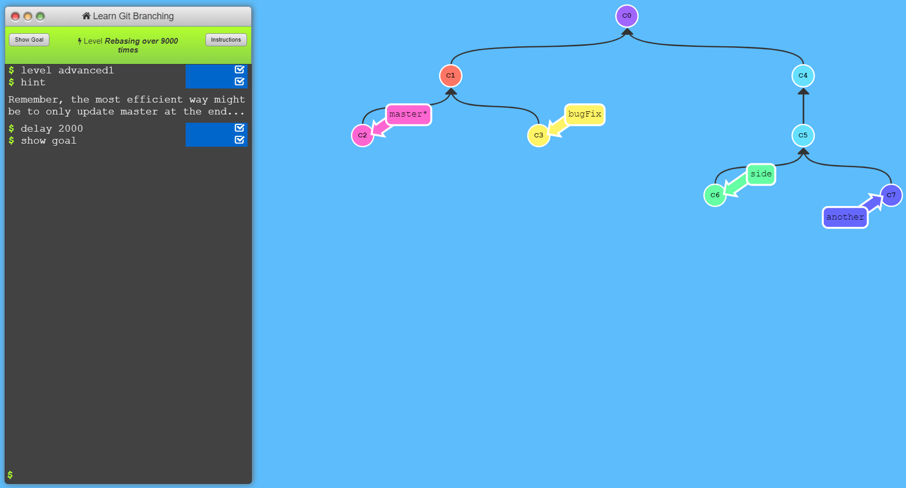

Tonight, we will all be contributing to an “open source” story! No programming required and have fun writing!

## Story Prompt
By some clerical error in WaterlooWorks, our protagonist got an offer from a big tech company as a Junior Software Developer. They know they are surely under-qualified, but what-the-hey, the proposition for free meals and unlimited snacks meant the offer was accepted anyways!  Write an day’s entry in their journal, as our protagonist fakes it till they make it!

## Instructions Checklist
1.	If you do not have a Github account, [follow this guide to create one](resources/github_signup_instructions.md).

2.	[Enter your name](http://bit.ly/2C3XZ0t) next to the day you want to write for in our protagonist’s diary.

3.	[Watch this video](https://www.youtube.com/watch?v=f5grYMXbAV0) on how to fork a repository, then fork the Coffee ‘N Code “GitHub-Workshop” repo.

4.	[Watch the first 5 min of this video](https://www.youtube.com/watch?v=OVQK2zzb6U8) on how to make a new branch and commit changes to your forked repo.

5. Create a branch with a name structured “day#” with the day you chose in step 2.

6. Within this branch, write a diary entry using [this template](resources/diary_entry_template.md), and commit your change.

7. [Read this article](https://help.github.com/articles/creating-a-pull-request-from-a-fork/) on how to make a pull request, then make a pull request that looks similar to the following image.

8.	Let someone on the Coffee 'N Code committee know about your pull request so they can approve it
9.	See your contribution made under the branch named “master” in the Coffee ‘N Code repo (not your forked repo)

10. ???
11. Profit $$$

## Additional Resources to Learn Git/GitHub
1. [Interactive Git Tutorial](https://learngitbranching.js.org/)

2. [Git/GitHub Video Playlist](https://www.youtube.com/playlist?list=PL5-da3qGB5IBLMp7LtN8Nc3Efd4hJq0kD)
3. [Git Cheatsheet](https://services.github.com/on-demand/downloads/github-git-cheat-sheet.pdf)
4. [Git Handbook](https://guides.github.com/introduction/git-handbook/)
